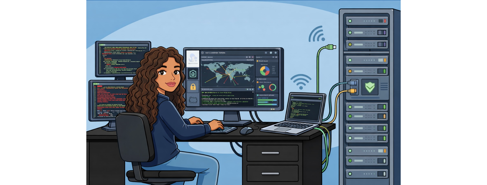

  

# Hola, soy Pamela Alcarrás (PAM JD LABS) 👋

### Administración de Sistemas (ASIR) | Especialista en Diagnóstico de Hardware

Soy una profesional técnica en transición hacia la **Ciberseguridad**. Mi perfil combina la precisión del diagnóstico físico (microsoldadura) con la gestión de infraestructuras lógicas (redes y sistemas).

  

---

## 🛠️ Tecnologías y Skills

  
  
  

- **Formación:** Actualmente cursando **ASIR** (Administración de Sistemas Informáticos en Red).
- **Especialidad:** Diagnóstico de fallos en placa base y reparación de dispositivos móviles.
- **Intereses:** Seguridad perimetral, Hardening de sistemas y electrónica con **Arduino**.

---

  ## 📁 Proyectos Destacados

* 💻 **[Laboratorio ASIR](https://github.com/pam-alcarras/Laboratorio-ASIR):** Configuraciones de red y administración de servidores.
* 🔌 **[Hardware Lab](https://github.com/pam-alcarras/Hardware-Lab):** Documentación de reparaciones y prototipos con Arduino.
